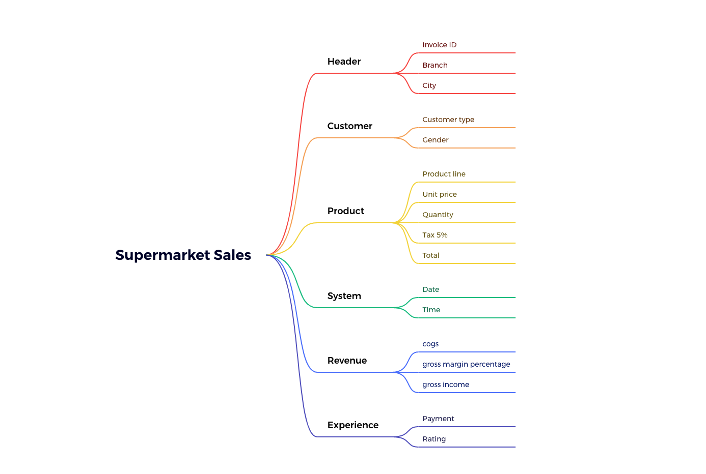

# Supermarket_data
Explorative analysis of a supermarket sales data set from Kaggel

## Source
https://www.kaggle.com/datasets/aungpyaeap/supermarket-sales

## Tools/ Dependancies

* Jupyter Lab

* Python ( Pandas, Numpy, Seaborn, Matplotlib )

* Xmind

## Data Columns

## Equations

cogs = Unit price * Quantity

Tax 5% = cogs * 5/ 100

Total = cogs + Tax 5%

gross income = Total * gross margin percentage/ 100

All products have the same gross margin percentage

## Conclusions

Creater of this dataset has balanced it for multiple fields.

## Setup

1. Python 3.8.9
2. pip 22.3.1
3. Jupyter-Lab 3.5.2
4. If you are setting up manually might need to update SciPy
5. Numpy 1.24.1
6. Pandas 1.5.2
7. Matplotlib 3.6.3
8. Seaborn 0.12.2
9. Download the CSV from https://www.kaggle.com/datasets/aungpyaeap/supermarket-sales and move to the same folder as the .ipynb file
10. Launch Jupyterlab and select Run All 

or 

1. Follow step 9 and 10 on your Google drive and open the .ipynb file in Google Colab
*Google Colab might not support newer version of Matplotlib/Seaborn, the plots might need small changes to display properly.

